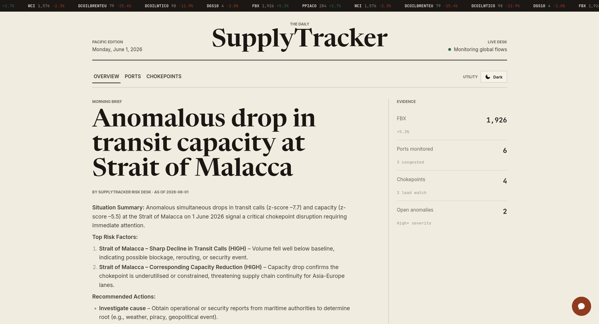
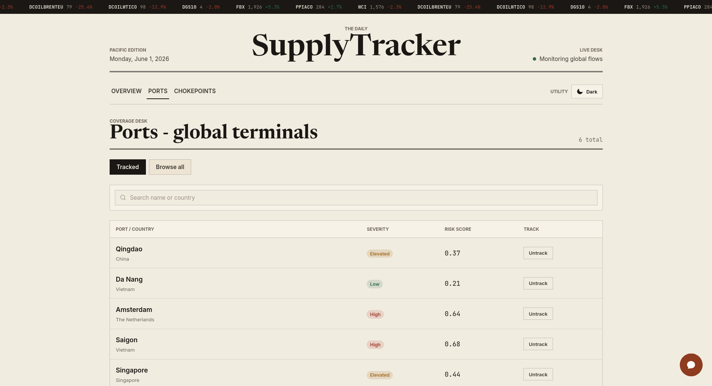
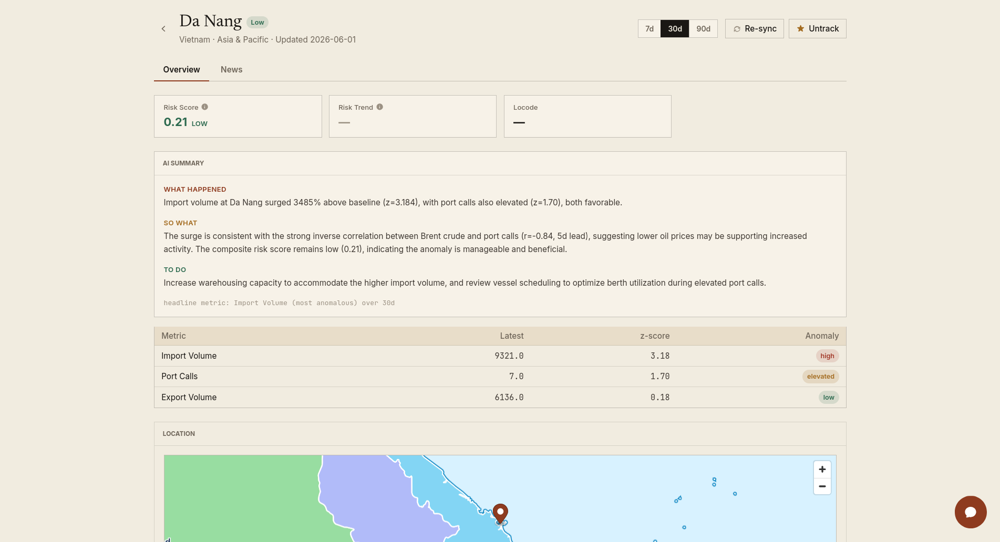

# SupplyTracker

SupplyTracker is an early-warning dashboard for global supply chains. It watches
the ports and maritime chokepoints that world trade flows through, turns raw
activity data into a daily risk score for each one, flags when something looks
abnormal, and explains what it means in plain language using an LLM.

The goal: instead of reading a dozen disconnected feeds, an analyst opens one
screen and sees *where pressure is building right now and why* — a congested
port, a slowdown at the Suez or Panama Canal, a freight-rate spike, a macro
signal turning — with a written brief that connects the dots.

The whole stack runs from one repository with Docker Compose: React frontend,
FastAPI backend, Postgres/PostGIS, Redis, Celery workers, scheduled jobs, plus
Flower and Mailpit for local observability.

## What It Tracks

- **Ports** — throughput, congestion, and dwell signals for the world's major
  container and bulk ports (sourced from IMF PortWatch).
- **Chokepoints** — transit activity through critical passages (Suez, Panama,
  Bab-el-Mandeb, Hormuz, Malacca, etc.) where a single disruption ripples
  outward across routes.
- **Freight & fuel** — container freight indices (FBX/WCI) and bunker fuel
  prices as cost-pressure signals.
- **Macro** — FRED economic indicators that move with trade demand.
- **News** — recent articles tied to each tracked port or chokepoint.

## Key Features

- **Per-entity risk scoring.** A scheduled pipeline computes a statistical
  baseline for every tracked port and chokepoint, then scores current activity
  against it. Scores are z-score driven, so "abnormal" is measured against each
  entity's own normal, not a global threshold.
- **Event detection.** When a signal breaks out of its expected range, the
  system records a discrete event (`RiskStoryEvent`) instead of just a number —
  so you get a timeline of *what happened when*, not only a gauge.
- **Disruption propagation.** A chokepoint event doesn't stay local. The scorer
  propagates its impact outward to the ports and routes that depend on that
  passage, surfacing second-order risk.
- **AI narratives & briefs.** High- and medium-severity events are turned into
  written insights by an LLM (DashScope Qwen). The Overview page also generates
  a daily decision **brief** that summarizes the current picture, and a **chat**
  endpoint lets you ask questions against the live data.
- **Story feed.** A chronological feed of detected events with their narratives,
  so the dashboard reads like a running situation report.
- **Track / untrack control.** You choose which ports and chokepoints to follow;
  collection, scoring, and news only run for tracked entities.

## How It Works

The data path is a scheduled pipeline owned by Celery beat:

```
Collectors        →  Scoring DAG                       →  AI layer        →  API / UI
(PortWatch, FRED,    1. compute baselines                 narrate events     FastAPI +
 FBX/WCI, bunker,    2. score ports + chokepoints         daily brief        SSE streams
 GNews)              3. detect events                     chat over data     ↓
                     4. propagate chokepoint disruption                      React dashboard
                     5. materialize insights                                 (Overview, Ports,
                     6. fill narratives (async LLM)                           Chokepoints)
```

1. **Collect.** Celery tasks pull fresh data from each source on a schedule and
   store it in Postgres (PostGIS for geo).
2. **Score.** The scoring DAG (`backend/app/tasks/score.py`) computes baselines,
   scores each entity, detects events, propagates chokepoint disruption, and
   materializes insight rows.
3. **Narrate.** A separate async task calls the LLM to write narratives, so slow
   model calls never block scoring.
4. **Serve.** FastAPI exposes the results; AI chat and briefs stream over
   Server-Sent Events. The React app renders three views — **Overview**
   (market + top risks + brief), **Ports**, and **Chokepoints** — each with
   detail pages showing history, news, and the event timeline.

The frontend is a lightweight hash-routed SPA (`/#/overview`, `/#/ports`,
`/#/chokepoints`) so it deploys cleanly to static hosts like Vercel.



## Screenshots

| Ports | Port detail |
| --- | --- |
|  |  |

## Stack

| Layer | Technology |
| --- | --- |
| Frontend | React 18, Vite, TypeScript, Tailwind, Recharts, deck.gl, MapLibre |
| Backend | FastAPI, SQLAlchemy, Alembic, Pydantic, Server-Sent Events |
| Data store | Timescale/Postgres with PostGIS extensions |
| Queue/cache | Redis, Celery worker, Celery beat |
| Data sources | IMF PortWatch, FRED, FBX/WCI scrapers, bunker price scraper, GNews |
| AI features | DashScope Qwen via OpenAI-compatible client |
| Local tools | Flower for Celery monitoring, Mailpit for local SMTP capture |

## Docker Compose Quick Start

Prerequisites:

- Docker Engine or Docker Desktop with Compose v2
- GNU Make
- API keys for the optional collectors and AI features you want to enable

```bash
git clone <repo-url>
cd SupplyTracker
cp .env.example .env
```

Fill in the required values in `.env`:

```bash
FRED_API_KEY=...
GNEWS_API_KEY=...
DASHSCOPE_API_KEY=...
SYNC_BEARER_TOKEN=<strong-random-token>
VITE_SYNC_BEARER_TOKEN=<same-token-if-you-want-the-sync-button>
```

Start the stack:

```bash
make up
```

Apply migrations and seed local demo data:

```bash
make bootstrap
```

Open the app:

- Frontend: http://localhost:5173
- Backend API: http://localhost:8000
- API docs: http://localhost:8000/docs
- Flower: http://localhost:5555
- Mailpit: http://localhost:8025

## Services

`docker-compose.yml` starts these containers:

| Service | Port | Purpose |
| --- | --- | --- |
| `frontend` | `5173` | Vite dev server for the React app |
| `backend` | `8000` | FastAPI API and SSE endpoints |
| `postgres` | `5432` | Timescale/Postgres database with PostGIS |
| `redis` | `6379` | Celery broker/result backend and cache |
| `celery-worker` | internal | Background collection, scoring, forecasting, and narrative tasks |
| `celery-beat` | internal | Scheduled collector/scoring/forecast jobs |
| `flower` | `5555` | Celery task monitor |
| `mailpit` | `1025`, `8025` | Local SMTP sink and web inbox |

## Make Targets

```bash
make help
make up          # build and start the Compose stack
make down        # stop and remove containers
make logs        # follow container logs
make migrate     # run Alembic migrations
make bootstrap   # migrate, then seed development data
make test        # run backend pytest suite inside Docker
make lint        # run backend ruff + mypy inside Docker
make shell-be    # open a backend container shell
make shell-fe    # open a frontend container shell
```

Frontend tests run from the frontend container:

```bash
docker compose exec frontend npm test
docker compose exec frontend npm run lint
```

## Data and Jobs

After `make bootstrap`, the app has demo ports, chokepoints, metrics, and risk
signals. Live data collection runs through Celery tasks:

- PortWatch tracked-entity refresh
- FRED macro indicators
- FBX and WCI freight indices
- Bunker fuel prices
- GNews articles for tracked entities
- Hourly risk scoring
- Daily forecast pass
- Daily AI narrative fill

Celery beat owns the schedule in `backend/app/tasks/schedule.py`. Flower at
http://localhost:5555 is the fastest way to confirm that workers and scheduled
tasks are registered.

## Sync Button

The UI can expose a protected Sync button on port and chokepoint detail pages.
It triggers backend sync endpoints such as `POST /api/v1/sync/all`.

Set the same token in backend and frontend env:

```bash
SYNC_BEARER_TOKEN=<strong-random-token>
VITE_SYNC_BEARER_TOKEN=<same-token>
```

The frontend also supports setting `sync_token` in `localStorage` at runtime.

## Environment Notes

Required for a useful local run:

- `DATABASE_URL`
- `REDIS_URL`
- `CELERY_BROKER_URL`
- `CELERY_RESULT_BACKEND`
- `PORTWATCH_BASE_URL`
- `VITE_API_BASE_URL`

Required for specific features:

- `FRED_API_KEY`: FRED collector
- `GNEWS_API_KEY`: news collection
- `DASHSCOPE_API_KEY`: AI chat, decision briefs, and narrative generation
- `SYNC_BEARER_TOKEN`: protected manual sync endpoints
- `FBX_SOURCE_URL`, `WCI_SOURCE_URL`: freight index scrapers when external source URLs are configured

See `.env.example` for the full list.

## Smoke Check

After `make bootstrap`, check:

- `GET http://localhost:8000/api/v1/health` reports `status`, `db`, and `redis` as `ok`
- The Overview page loads market indices, tracked ports, and chokepoints
- Ports page lists tracked ports and track/untrack controls
- Chokepoints page lists tracked chokepoints
- API docs load at http://localhost:8000/docs
- Flower lists registered Celery tasks at http://localhost:5555
- Mailpit opens at http://localhost:8025

## Vercel Frontend + ngrok Backend (Split Deploy)

You can host the frontend on Vercel while the backend stack keeps running on your
own machine via Docker Compose, exposed publicly through an ngrok tunnel.

### 1. Run the backend locally

```bash
make up
make bootstrap
```

The backend listens on `http://localhost:8000`.

### 2. Tunnel the backend with ngrok

A reserved ngrok domain keeps the URL stable, so you only configure Vercel once:

```bash
ngrok config add-authtoken <your-token>      # one-time
ngrok http --url=<your-domain>.ngrok-free.dev 8000
```

ngrok-free serves a browser interstitial on requests with a browser User-Agent.
The frontend API client sends the `ngrok-skip-browser-warning: true` header on
every request (`frontend/src/api/client.ts`) so `fetch()` receives JSON instead
of the warning HTML.

### 3. Allow the Vercel origin in CORS

Add your Vercel URL to `CORS_ORIGINS` in `.env` (comma-separated, no trailing
path):

```bash
CORS_ORIGINS=http://localhost:5173,https://<your-app>.vercel.app
```

Recreate the backend container so the new env is loaded. `docker compose
restart` does **not** re-read `.env` — use:

```bash
docker compose up -d backend
```

Verify the preflight returns the origin:

```bash
curl -s -i -X OPTIONS http://localhost:8000/api/v1/ \
  -H "Origin: https://<your-app>.vercel.app" \
  -H "Access-Control-Request-Method: GET" | grep -i access-control-allow-origin
```

### 4. Point Vercel at the tunnel

In the Vercel project: Settings → Environment Variables:

```
VITE_API_BASE_URL = https://<your-domain>.ngrok-free.dev
```

`VITE_` vars are injected at build time, so redeploy after changing it. With a
reserved ngrok domain you set this once and never redeploy for tunnel changes.

The frontend stays up on Vercel even while your machine is off; API-backed views
only work while the backend and ngrok tunnel are running.

## Free-Tier Cloud Deploy (Render + Supabase + Upstash)

A fully free split deploy without ngrok. Trades the Compose stack's worker/beat
and TimescaleDB for managed equivalents:

| Piece | Free service | Notes |
|-------|--------------|-------|
| Frontend | Vercel | unchanged |
| Backend (FastAPI) | Render web service | sleeps after 15 min idle (~30 s cold start) |
| Postgres + PostGIS | Supabase / Neon | no TimescaleDB — migration skips hypertables (tables stay plain Postgres) |
| Redis | Upstash | app cache + rate-limit; Celery runs eager so the broker isn't used for transport |
| Scheduler | cron-job.org / GitHub Actions | replaces celery-beat by POSTing `/api/v1/cron/run` |

Two pieces of the Compose stack are intentionally dropped: the **TimescaleDB
extension** (no free managed PG offers it) and the **Celery worker + beat**
(background workers aren't free on Render). The migration auto-detects a missing
`timescaledb` extension and skips the hypertable conversions, and
`CELERY_TASK_ALWAYS_EAGER=true` runs tasks inline in the web process.

### 1. Provision the managed services

- **Supabase/Neon**: create a project, enable PostGIS (`create extension postgis;`
  — Supabase has it built-in), and copy the connection string. Rewrite the driver
  prefix to `postgresql+psycopg://…` and keep `?sslmode=require`.
- **Upstash**: create a Redis database, copy the `rediss://…` URL.

### 2. Deploy the backend on Render

The repo ships a `render.yaml` Blueprint. In Render: **New → Blueprint**, point at
this repo. Set the `sync:false` secrets in the dashboard: `DATABASE_URL`,
`REDIS_URL`, `CELERY_BROKER_URL`, `CELERY_RESULT_BACKEND` (all three Redis vars =
the same Upstash URL), `SYNC_BEARER_TOKEN`, `CORS_ORIGINS` (your Vercel origin),
`FRED_API_KEY`, `GNEWS_API_KEY`, `DASHSCOPE_API_KEY`, and `VITE_API_BASE_URL`.
The start command runs `alembic upgrade head` (idempotent) then uvicorn.

### 3. Point Vercel at Render

Set `VITE_API_BASE_URL` to the Render service URL and `VITE_SYNC_BEARER_TOKEN`
to match `SYNC_BEARER_TOKEN`, then redeploy the Vercel project (`VITE_` vars are
build-time).

### 4. Schedule the pipeline

celery-beat is gone, so drive the pipeline with any external cron hitting the
bearer-protected endpoint:

```bash
curl -X POST "https://<render-app>.onrender.com/api/v1/cron/run?jobs=collect,score,forecast,narrate" \
  -H "Authorization: Bearer <SYNC_BEARER_TOKEN>"
```

`jobs` accepts any subset of `collect,score,forecast,narrate` (always run in
dependency order). Point a daily cron-job.org job (or a scheduled GitHub Action)
at it. The first request after idle also warms the sleeping Render instance.

## Current Deployment Posture

The project is currently optimized for one-host Docker Compose deployment. For a
VPS, copy the repository, provide a production `.env`, run `make up`, run
`make migrate`, and place a reverse proxy such as Caddy, Nginx, or Traefik in
front of the frontend and backend ports.
